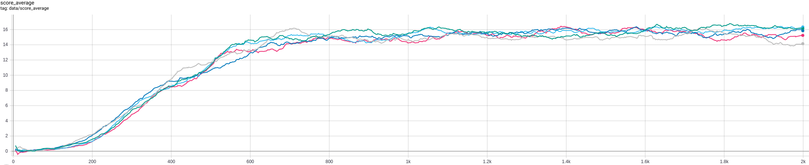
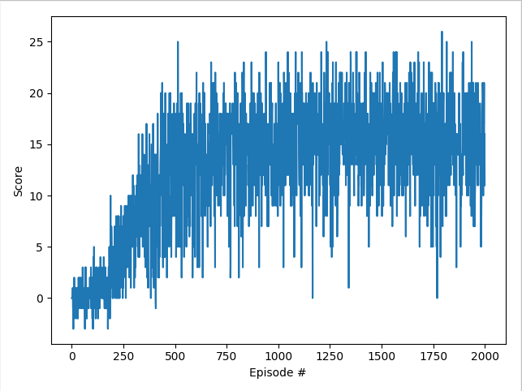

# Project 1: Navigation

The project consists of training an agent to collect as many bananas as possible using Deep Q-Learning

The agent will navigate within a Unity environment and can perform 4 actions (up, down, left, right) 

A reward of +1 is provided for collecting a yellow banana, and a reward of -1 is provided for collecting a blue banana. Thus, the goal of your agent is to collect as many yellow bananas as possible while avoiding blue bananas.
## Table of contents


## Getting Started

These instructions will help with setting up the project

### Prerequisites
Create a virtual environment with conda:
```
conda create -n drl_banana python=3.7
conda activate drl_banana
```

You need to install the following:
```
cd environment/setup
pip install .
```
This will take care of installing all the dependencies needed

### Installing

The following steps allows to setting up the project correctly

Say what the step will be

```
move the 'Banana_Linux' folder inside 'environment/'
```

## Running the code

The project is divided in two sections: training & testing

### Training

To start training the agent run the following:

```
python main_banana
```
The code will generate Tensorboard stats for visualisation. You can see them by running:
```tensorboard --logdir run``` from the ```drl_banana``` folder

### Testing
The latest model from the agent will be saved in ```checkpoint.pth```.
Rename ```checkpoint.pth``` into ```model.pth``` 

To look at the agent in action run the following:

```
python replay_banana
```

## Results
Here is a video of the agent in action:

https://youtu.be/uQFR3ll6CqM

Here is a graph of the progression of the last 100 scores average from Tensorboard


Here is a graph showing the progression of the score on a single run (not averaged):
